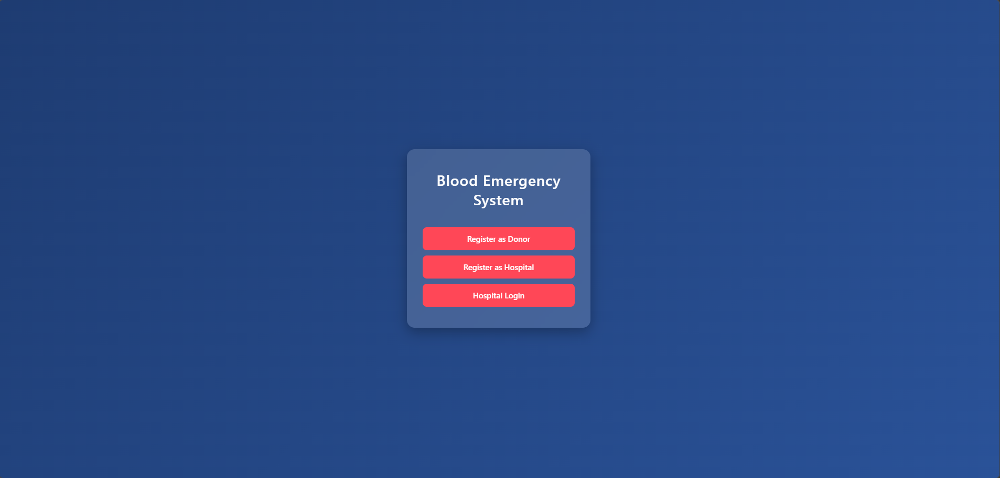
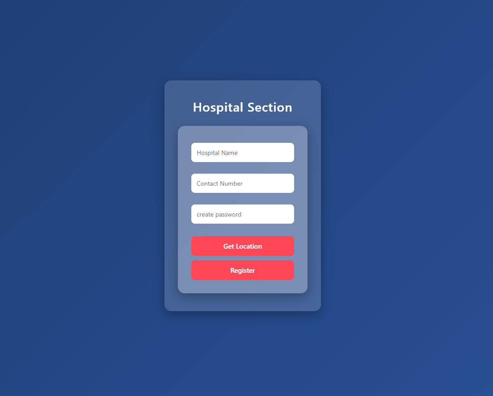
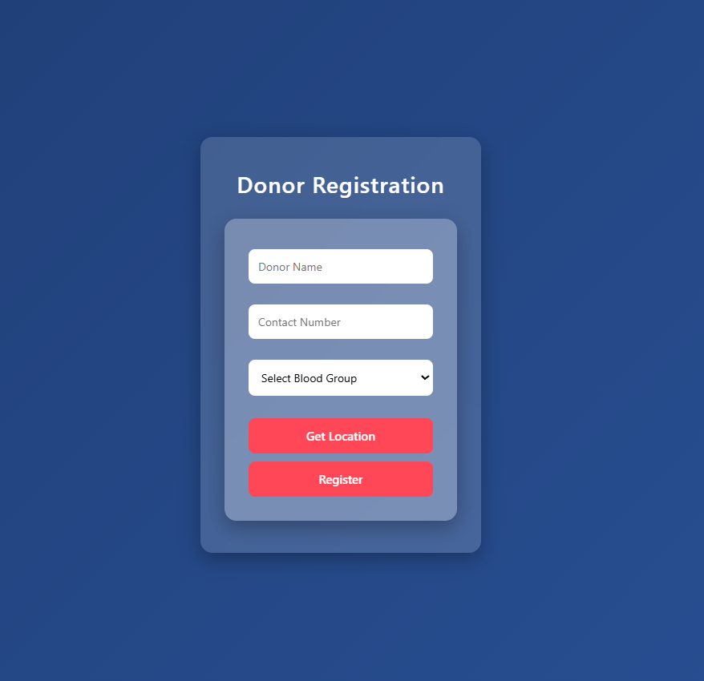
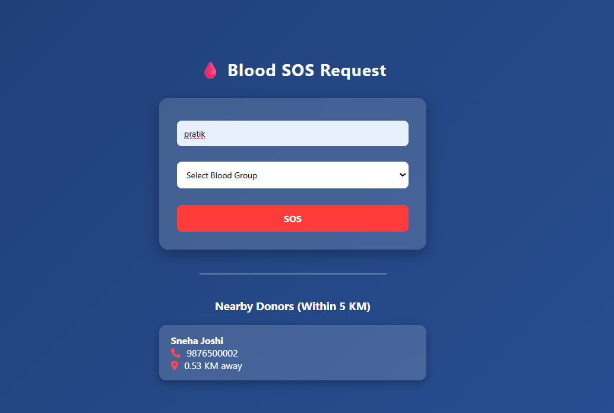

# 🩸 Blood SOS System

A web-based emergency blood donation system built using Flask.  
This application helps hospitals quickly find nearby blood donors during emergencies.

---

##  Features

- 🏥 Separate login for Hospitals
- 👤 Donor Registration System
- 📍 Live Location Capture
- 📏 Nearest Donor Detection
- 🚨 SOS Emergency Alert System
- 📊 Clean Dashboard UI
- 🔐 Secure Flask Backend

---

## 🛠️ Tech Stack

- Python
- Flask
- SQLAlchemy
- HTML5
- CSS3
- Bootstrap (if used)
- SQLite Database

---

##  Screenshots

###  Home Page


---

###  Hospital Dashboard


---

###  Donor Registration


---

###  SOS Result Page


---

##  Installation & Setup

1. Clone the repository:

```bash
git clone https://github.com/pratikkhandve55/Blood_DonationAPP.git
